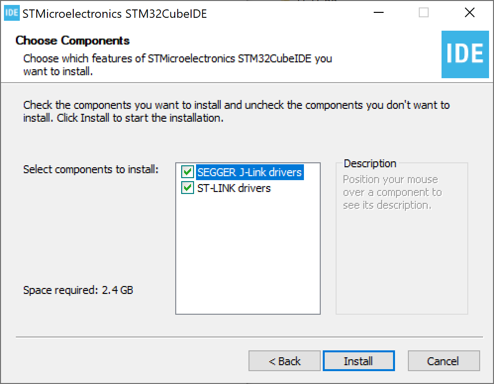
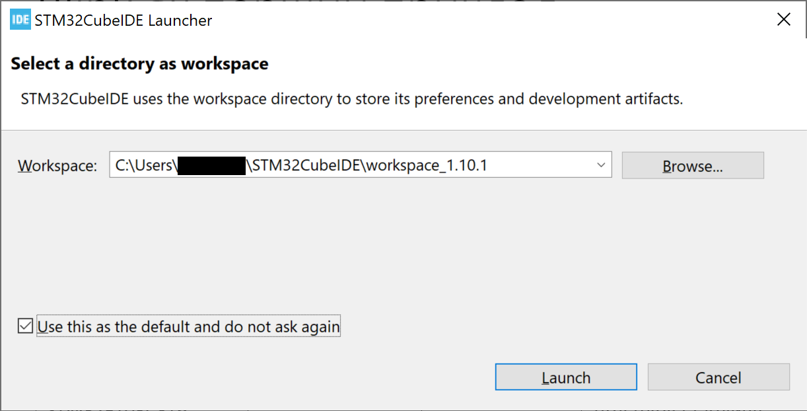
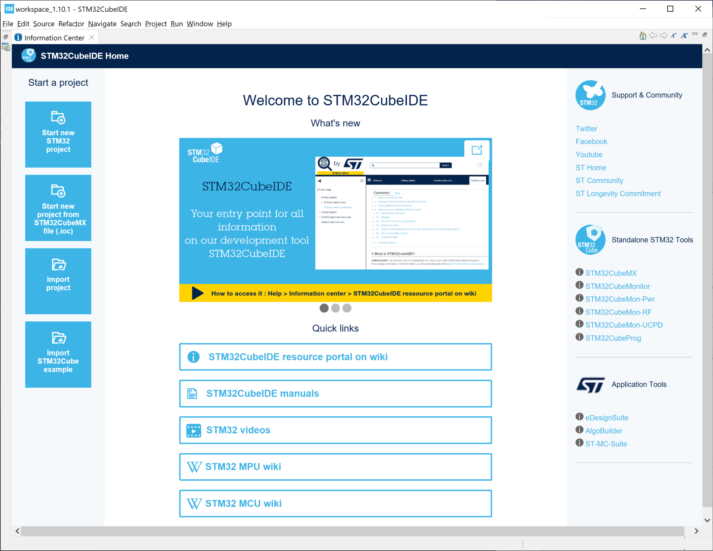
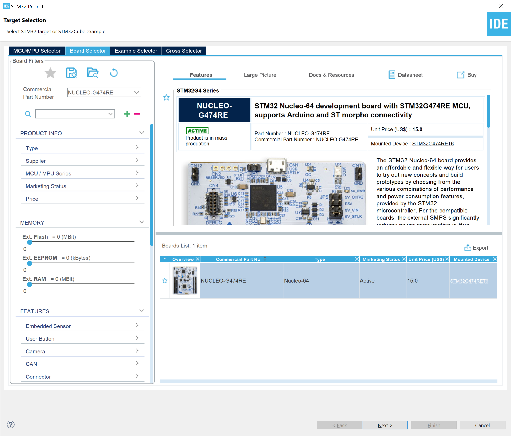
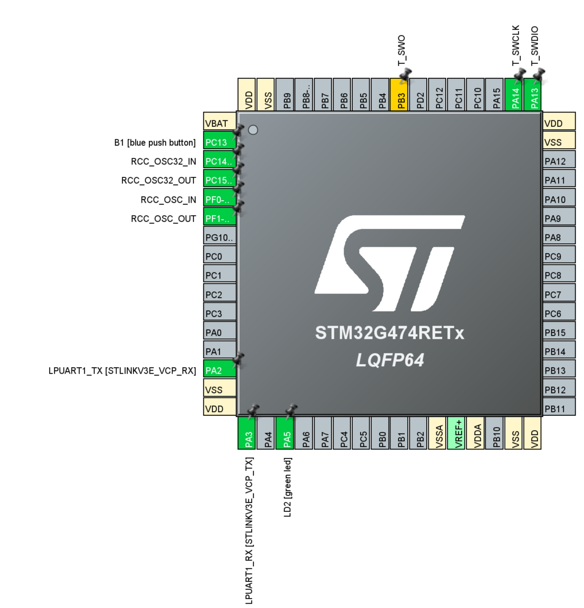

# Set-up the desktop environment and first example

## 1. Install the STM32CubeIDE

In these examples I'll be using official tool [STM32CubeIDE](https://www.st.com/en/development-tools/stm32cubeide.html#st-get-software). It is free, but requires the registration/creating account with STMicroelectronics.

At the moment of writing this, the active version is `1.10.1`. Installers for:
- [Windows](https://www.st.com/content/ccc/resource/technical/software/sw_development_suite/group0/f6/49/9f/f9/96/8a/47/84/stm32cubeide_win/files/st-stm32cubeide_1.10.1_12716_20220707_0928_x86_64.exe.zip/jcr:content/translations/en.st-stm32cubeide_1.10.1_12716_20220707_0928_x86_64.exe.zip)
- [Debian Linux](https://www.st.com/content/ccc/resource/technical/software/sw_development_suite/group0/1d/69/cb/af/24/d9/44/78/stm32cubeide_deb/files/st-stm32cubeide_1.10.1_12716_20220707_0928_amd64.deb_bundle.sh.zip/jcr:content/translations/en.st-stm32cubeide_1.10.1_12716_20220707_0928_amd64.deb_bundle.sh.zip)
- [Generic Linux](https://www.st.com/content/ccc/resource/technical/software/sw_development_suite/group0/e7/6e/03/0a/97/9f/49/2d/stm32cubeide_lnx/files/st-stm32cubeide_1.10.1_12716_20220707_0928_amd64.sh.zip/jcr:content/translations/en.st-stm32cubeide_1.10.1_12716_20220707_0928_amd64.sh.zip)
- [MacOS](https://www.st.com/content/ccc/resource/technical/software/sw_development_suite/group0/a6/01/38/83/32/4c/48/57/stm32cubeide_mac/files/st-stm32cubeide_1.10.1_12716_20220707_0928_x86_64.dmg.zip/jcr:content/translations/en.st-stm32cubeide_1.10.1_12716_20220707_0928_x86_64.dmg.zip)
- [RPM Linux](https://www.st.com/content/ccc/resource/technical/software/sw_development_suite/group0/6d/85/7c/4e/77/b6/48/b9/stm32cubeide_rpm/files/st-stm32cubeide_1.10.1_12716_20220707_0928_amd64.rpm_bundle.sh.zip/jcr:content/translations/en.st-stm32cubeide_1.10.1_12716_20220707_0928_amd64.rpm_bundle.sh.zip)

### Windows 7, 10, 11
After downloading, unpack the archive (either with [7-zip](https://www.7-zip.org/), or whatever) and run the installer and make sure to select installation of drivers.

After installation run `STM32CubeIDE` from the Start menu to launch the initial setup for projects.

I would also change the working workspace to `C:\Users\username\STM32CubeIDE\workspace` instead of versioned one.

### If computer is intended to be used offline only

## 2. First example: "Blink"

When the `STM32CubeIDE` is started, press the `Start new STM32 project` button:

to call for a target selector window. Type the needed microcontroller number or development board name into `Commercial Part Number` field, select the targeted board / microcontroller from the available list and click `Next`:

Than edit the name of the created project (I placed `nucleo-blink`), switch the used language to `C++` instead of `C` and click `Finish`. Answer affirmative to the request to initialize peripherals in the default mode and to open associated perspective.

It will show the window with all peripherals, which are set-up by default. What we are looking now is where is located the needed LED. On this board it is marked as `LD2` and is attached to the pin `PA5`

