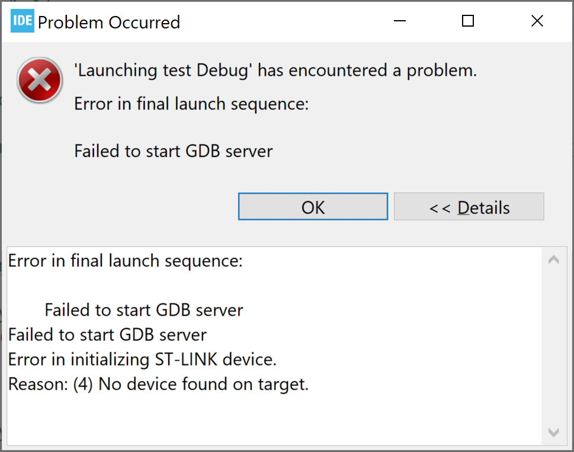
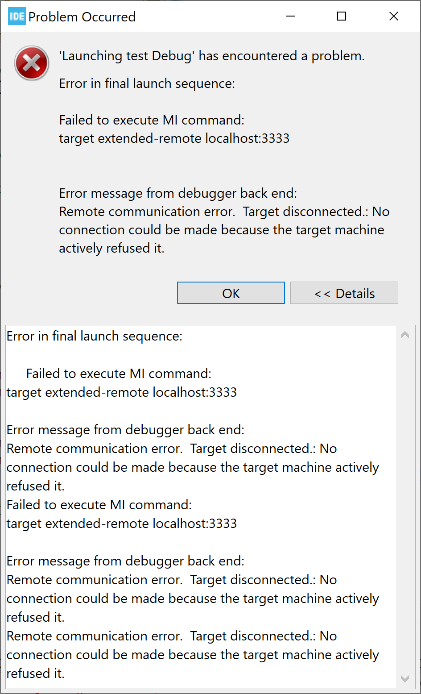
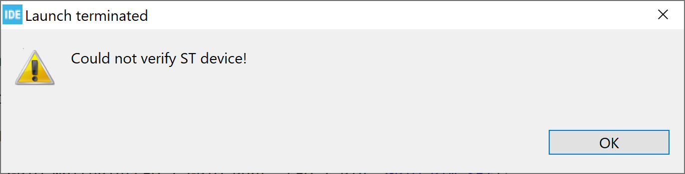
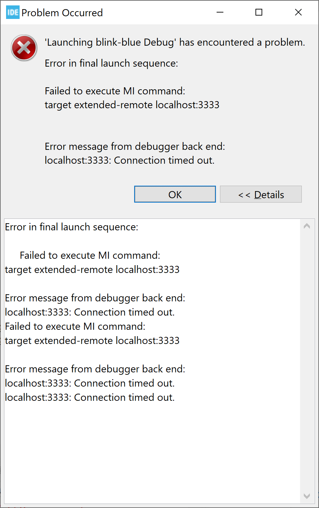

# Develop, Flash, and Debug for counterfeit STM32 or clones


## 1. Developing and Debug

On the latest STM32CubeMX 1.10.1 when the replica is connected for debugging via STLink, you'll receive the following error:



and the terminal window will show something alike:
```
STMicroelectronics ST-LINK GDB server. Version 5.8.0
Copyright (c) 2020, STMicroelectronics. All rights reserved.

Starting server with the following options:
        Persistent Mode            : Disabled
        Logging Level              : 1
        Listen Port Number         : 61234
        Status Refresh Delay       : 15s
        Verbose Mode               : Disabled
        SWD Debug                  : Enabled
        InitWhile                  : Enabled


Error in initializing ST-LINK device.
Reason: ST-LINK: Could not verify ST device! Abort connection.
```

Reason is added requirement for chip authenticity check in more recent versions. However, there are work arounds:

### 1.1. Official tools from STMicroelectronics

#### 1.1.1. Using older version of STM32CubeIDE + OpenCDC

The last version of STM32CubeIDE which still allows to program and debug non-original STM32-chips without modifications is 1.7.0 (also tested: 1.5.0 ; 1.5.1; 1.6.0; 1.6.1).

Tested on STLink V2 with firmware V2.J37.S7 (in fact, a clone based on CKS32F103C8T6) and STlink V3 Mini with firmware V3.J10.M3 .

Worth mentioning, that even this workaround raises a lot of warnings:
```
Open On-Chip Debugger 0.11.0-rc2+dev-00044-g8340bb0 (2021-06-02-17:29)
Licensed under GNU GPL v2
For bug reports, read
	http://openocd.org/doc/doxygen/bugs.html
Info : Listening on port 6666 for tcl connections
Info : Listening on port 4444 for telnet connections
Info : STLINK V2J37S7 (API v2) VID:PID 0483:3748
Info : Target voltage: 3.175049
Info : clock speed 4000 kHz
Info : stlink_dap_op_connect(connect)
Info : SWD DPIDR 0x2ba01477
Info : STM32F103C8Tx.cpu: hardware has 6 breakpoints, 4 watchpoints
Info : starting gdb server for STM32F103C8Tx.cpu on 3333
Info : Listening on port 3333 for gdb connections
Info : accepting 'gdb' connection on tcp/3333
Info : device id = 0x20036410
Info : flash size = 128kbytes
Warn : GDB connection 1 on target STM32F103C8Tx.cpu not halted
undefined debug reason 8 - target needs reset
Info : accepting 'gdb' connection on tcp/3333
Warn : GDB connection 2 on target STM32F103C8Tx.cpu not halted
undefined debug reason 8 - target needs reset
target halted due to debug-request, current mode: Thread
xPSR: 0x01000000 pc: 0x080003a8 msp: 0x20005000
target halted due to debug-request, current mode: Thread
xPSR: 0x01000000 pc: 0x080003a8 msp: 0x20005000
shutdown command invoked
Info : dropped 'gdb' connection
shutdown command invoked
```




Interestingly enough, this work around didn't work when used STLink v3 from Nucleo-G474 board. In such case it raises error:

```
Open On-Chip Debugger 0.11.0-rc2+dev-00044-g8340bb0 (2021-06-02-17:29)
Licensed under GNU GPL v2
For bug reports, read
	http://openocd.org/doc/doxygen/bugs.html
Info : Listening on port 6666 for tcl connections
Info : Listening on port 4444 for telnet connections
Info : STLINK V3J10M3 (API v3) VID:PID 0483:374E
Info : Target voltage: 3.268526
Info : clock speed 8000 kHz
Info : stlink_dap_op_connect(connect)
Info : SWD DPIDR 0x2ba01477
Warn : target STM32F103C8Tx.cpu examination failed
Info : starting gdb server for STM32F103C8Tx.cpu on 3333
Info : Listening on port 3333 for gdb connections
Info : accepting 'gdb' connection on tcp/3333
Error: Target not examined yet
Error: auto_probe failed
Error: Connect failed. Consider setting up a gdb-attach event for the target to prepare target for GDB connect, or use 'gdb_memory_map disable'.
Error: attempted 'gdb' connection rejected
```

Version 1.8.0 already shows following error regardless of used parameters an programmer:


```
Open On-Chip Debugger 0.11.0+dev-00438-ga75fc63 (2021-11-03-15:27)
Licensed under GNU GPL v2
For bug reports, read
	http://openocd.org/doc/doxygen/bugs.html
Info : Listening on port 6666 for tcl connections
Info : Listening on port 4444 for telnet connections
Info : STLINK V2J37S7 (API v2) VID:PID 0483:3748
Info : Target voltage: 3.177113
Info : clock speed 4000 kHz
Info : stlink_dap_op_connect(connect)
Info : SWD DPIDR 0x2ba01477
Info : STM32F103C8Tx.cpu: Cortex-M3 r2p1 processor detected
Info : STM32F103C8Tx.cpu: target has 6 breakpoints, 4 watchpoints
Info : starting gdb server for STM32F103C8Tx.cpu on 3333
Info : Listening on port 3333 for gdb connections
Info : accepting 'gdb' connection on tcp/3333
Info : device id = 0x20036410
Info : flash size = 128kbytes
Warn : GDB connection 1 on target STM32F103C8Tx.cpu not halted
undefined debug reason 8 - target needs reset
O.K.

O.K.:0xE00FFFD0

undefined debug reason 8 - target needs reset
shutdown command invoked
Info : dropped 'gdb' connection
```

#### 1.1.2. Edit ChipID for OpenCDC config + STM32CubeIDE (didn't work!)

Tested on STM32CubeIDE 1.10.1

In STM32CUBEIDE: select OpenOCD as the programming / debugging and `Software System Reset`

To change the config file:

Open in explorer folder: `C:/ST/STM32CubeIDE_1.10.1/STM32CubeIDE/plugins` there should be a folder which name starts with `com.st.stm32cube.ide.mcu.debug.openocd_` and have large version number in the end, open it. Now, whithinit, navigate to `resources/openocd/st_scripts/target` and edit file `stm32f1x.cfg`.

In my case, full path is `C:\ST\STM32CubeIDE_1.10.1\STM32CubeIDE\plugins\com.st.stm32cube.ide.mcu.debug.openocd_2.0.300.202206090745\resources\openocd\st_scripts\target\stm32f1x.cfg`

Before first `if` statement, insert either: `set CPUTAPID 0` or `set CPUTAPID 0x2ba01477`.

The `set CPUTAPID 0` forces OpenOCD to ignore all id numbers, which means all clones or genuine MCUs would work, while `set CPUTAPID 0x2ba01477` will specify only the MCUs which will work, ignoring all others. THis might also lead to problems with other chips (some of them have `0x1ba01477`).

This recepie is considered to be working, but in my case it created error:
```
Open On-Chip Debugger 0.11.0+dev-00449-g53fa0f7 (2022-06-09-09:42) [https://github.com/STMicroelectronics/OpenOCD]
Licensed under GNU GPL v2
For bug reports, read
	http://openocd.org/doc/doxygen/bugs.html
Info : Listening on port 6666 for tcl connections
Info : Listening on port 4444 for telnet connections
Info : STLINK V2J37S7 (API v2) VID:PID 0483:3748
Info : Target voltage: 3.169371
Error: init mode failed (unable to connect to the target)
```

and rises as few timeout errors.




### 1.2. Mbed

For use with Mbed / Platformio, some sellers on Amazon suggests to use an STLink v2 as many many clones do not behave exactly the same way as STM32 with regards to programming. The `platformio.cfg` file should contain:

```
[env:bluepill_f103c8]
platform = ststm32
board = bluepill_f103c8
board_build.mcu = STM32F103C6T6
upload_flags = -c set CPUTAPID 0x2ba01477
framework = arduino
```

Or another CPUTAID, depending on the exact clone.

## 2. Flash

In case if you need to upload existing (compiled) firmware (*.hex, *.bin, etc.) to the microcontroller which is not original, simply use either [STM32CubeProgrammer](https://www.st.com/en/development-tools/stm32cubeprog.html), as of version 2.11.0
