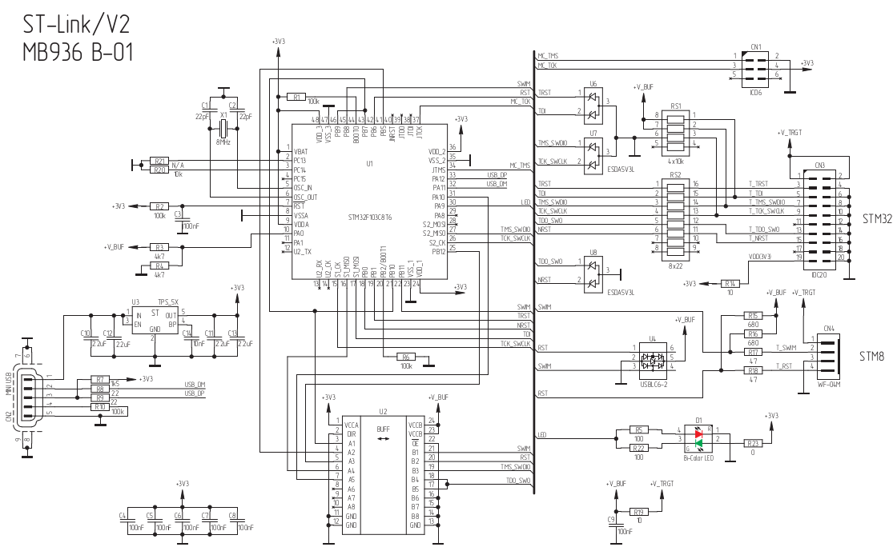

Schematics of original STLink is not open-sorce, but following schematics could be found:

To flash firmware int this copy:
- STM32CubeProgrammer 1.3 ([proof](https://www.youtube.com/watch?v=dOatOX2CPeI))

Other links on topic:
- http://we.easyelectronics.ru/STM32/sozdaem-st-link-v2.html
