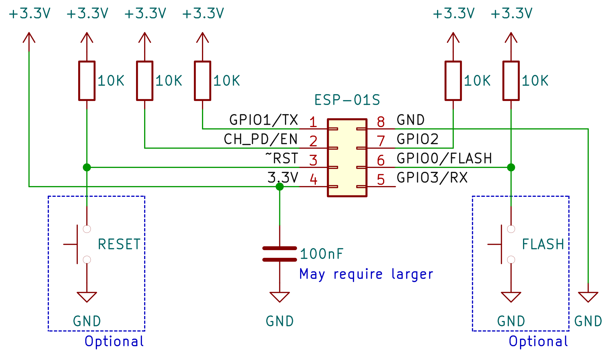
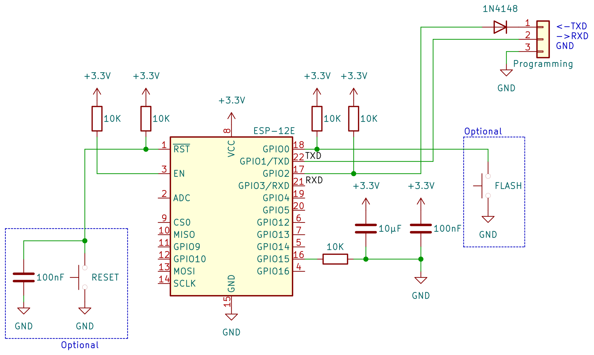

# ESP-01S
These modules became quite popular for small applications, especially for monitoring, logging data or controlling devices via MQTT servers. However, such modules requires special schematic on device.

According to datasheets, the `GPIO0` and `GPIO2` must be pulled-up at the moment of start to ensure operational start-up, otherwise module awaits re-flashing (uploading the new firmware). On some forums, there are posts stating that `TX` line also should be pulled-up, so the schematics should be:

Additional requirements is additional capacitor between 3.3V and GND near the module socket.

For operational purposes, the buttons could be omitted, but pull-up resistors are mandatory.

However, the good practice could be to pull-up ALL `GPIOx` contacts and use inversed logic for controlling the target devices.

# ESP12F Start-up circuit
The minimal schematics should be: \

